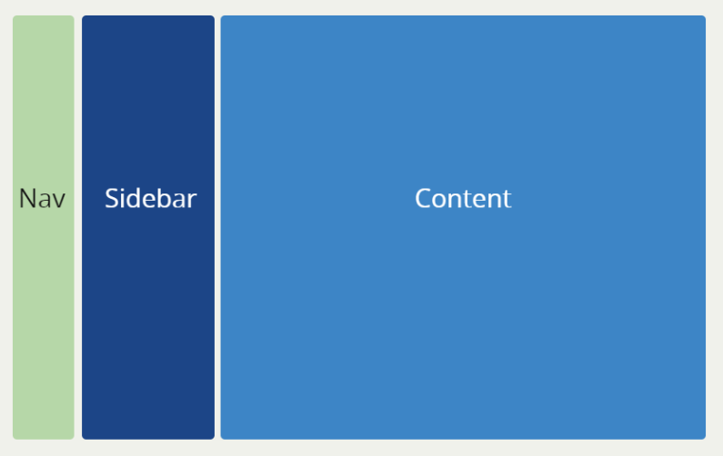
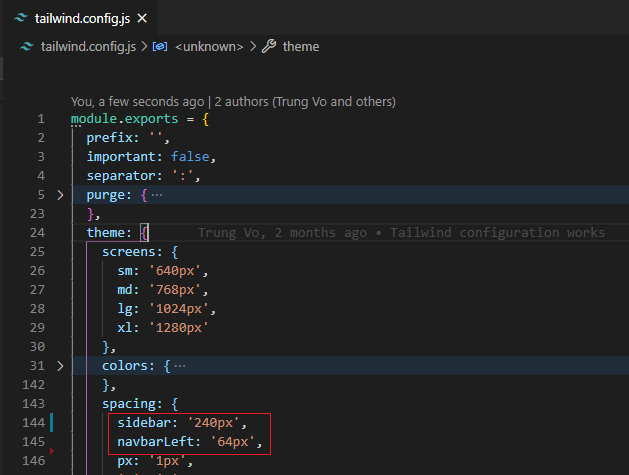
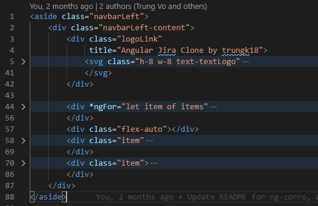
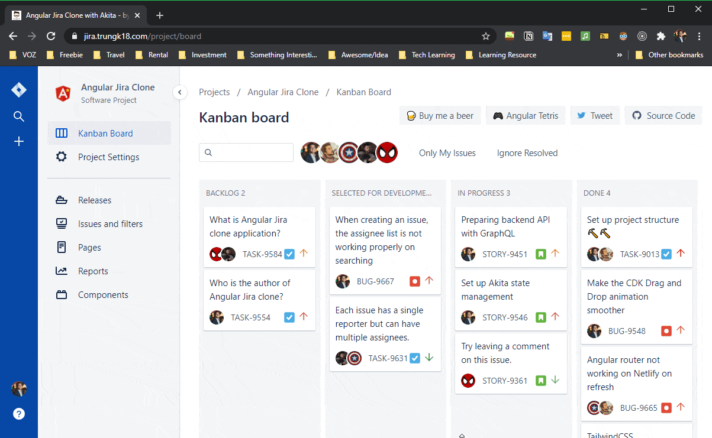
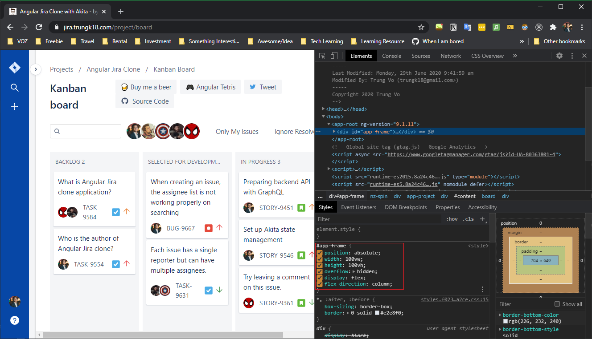
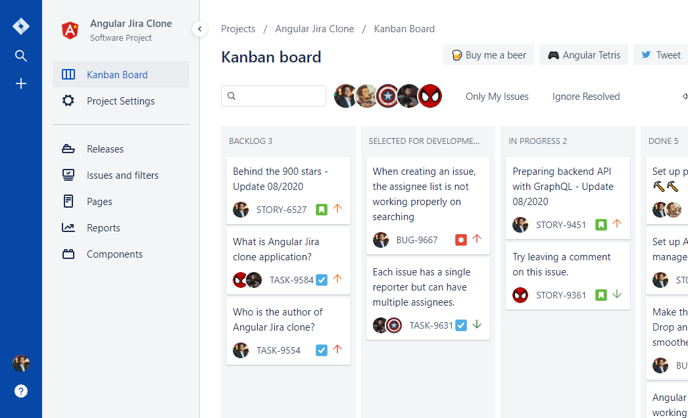

# Day 41: Jira Clone Tutorial 02 - Dựng layout với flexbox và TailwindCSS

Phần thứ hai của series sẽ nói về việc dựng layout của ứng dụng với flexbox và TailwindCSS.

Các bạn checkout branch [tailwind-configuration][tailwindbranch] trước khi bắt tay vào làm theo các bước dưới đây nhé.

## Navigation Section

Ứng dụng [jira clone][jira] sẽ có mấy phần chính:

- Left navigation ngoài cùng bên trái, hiển thị logo và vài cái icons, ảnh đại điện của người dùng và một biểu tượng dấu chấm hỏi ở dưới cùng.
- Cột sidebar ngay bên cạnh left nav có thể đóng/mở (collapsible) hiển thị một vài đường dẫn như đến phần settings hay board của ứng dụng
- Một cái resizer để đóng/mở cột sidebar
- Phần hiển thị nội dung của cái board kéo thả hay là một form.

Dựa trên phác thảo ở trên thì chắc bạn cũng hình dung được là sẽ có các component khác nhau cho từng phần nhỏ. Và dưới đây là mockup.



Ba cột được sắp xếp theo một chiều từ trái qua phải, do đó mình chọn flexbox để code phần layout. Phần code trông khá đơn giản như ở dưới.

[navigation.component.html][navigation-component]

```html
<div class="navigation">
  <div class="flex flex-row overflow-hidden h-full">
    <app-navbar-left></app-navbar-left>
    <app-sidebar [expanded]="expanded"></app-sidebar>
  </div>
  <app-resizer (click)="toggle()" [expanded]="expanded"></app-resizer>
</div>
```

```css
.navigation {
  display: flex;
}
```

### 1. Custom TailwindCSS

Mình cần chiều rộng của navbar 64px và sidebar là 240px nên mình sẽ update file [tailwind.config.js][tailwind.config.js] để có được thêm hai custom spacing cần thiết.



Mặc định thì [spacing scale][tailwind-spacing] được Tailwind sử dụng để tạo ra các class liên quan đến padding, margin, width, and height. Nên config trong hình trên sẽ tạo ra các class dạng `.p-2, .mt-3, .w-5, .h-6` và chắc chắn là hai class mình cần, `w-sidebar` and `w-navbarLeft`.

### 2. Left Navigation

Sau khi để config Tailwind như ở bước một, mình bắt đầu xây dựng left nav component.

[navbar-left.component.scss][navbar-left.component.scss]

```css
.navbarLeft-content {
  @apply h-screen w-navbarLeft pt-6 pb-5 flex flex-col bg-primary flex-shrink-0;
}

.logoLink {
  @apply relative pb-2 flex items-center justify-center;
}
```

Đây là một phiên bản đơn giản của code HTML mình dùng cho left nav. Đơn giản là có một `aside[class='navbar']` bao ngoài class `.navbarLeft-content`, chỗ mình CSS như ở trên: set chiều cao tối đa của viewport (`100vh`), thêm `padding` và `margin` và `flex` style.



Để đi qua từng CSS property làm việc gì thì sẽ rất khó bởi vì thời gian của mình có hạn và nếu bài viết dài quá cũng khiến anh em hết hứng đọc. Cứ clone code mình về check là sẽ hiểu hết 😂

### 3. Sidebar

Khá là giống với những gì mình đã làm ở bước 2 cho left nav, chúng ta sẽ vẫn dùng `flex` cho sidebar. Nhưng có một thử thách khá thú vị xuất hiện: `scrollable content`.



Đại khái, mình muốn có cái thanh cuộn dọc nếu như **không có đủ không gian**. Nghe thì đơn giản, nhưng khá phức tạp nhiều lúc 🤣

### 4. Scroll-able container with dynamic height using Flexbox

Mình có đọc một bài viết rất hay về việc [Làm thế nào để có scrollable container với chiều cao động (dynamic) dùng Flexbox by @stephenbunch][flexbox].

Một trong những feature khá hay ho của [Flexbox](https://css-tricks.com/snippets/css/a-guide-to-flexbox/) là tạo khả năng cho flex child scrollable. Ngày trước, nếu muốn có một scrollable container thì phải set height cho cái container đấy. Cái chiều cao ko thể dc tự động tính toán dựa mấy cái div xung quanh được. Phải dùng pixels, hoặc phần trăm, hoặc dùng absolute.

Đoạn này khó dịch quá. Anh em đọc tiếng Anh cho tường minh nhé 😂

With Flexbox, we can now create scrollable containers whose size depends on the available space after the rest of the content has been laid out.

> The key is to use Flexbox for all containers that wrap the scrollable container and give the outermost container a predefined height. Since content lays vertically on the page by default, I recommend making each container use the vertical (column) flex layout rather than the default horizontal (row) layout.

Đại ý là nếu muốn có thanh cuộn ở một child nào đấy, bạn phải set height cho thằng div ở level cao nhất, và tất cả child của nó phải là flexbox.

Xem ví dụ ở dưới

> https://codepen.io/stephenbunch/pen/KWBNVo

Mình cũng làm tương tự với Jira clone, bắt đầu dùng flex ở trên cùng `app-component` cho đến khi đến được chỗ mình cần scrollable thì thôi.



### 5. Resizer

Phần này khá đơn giản, mình có một component resizer nhận vào một biến boolean để thay đổi cái dấu mũi tên (trái/phải)

```ts
export class ResizerComponent implements OnInit {
  @Input() expanded: boolean;

  get icon() {
    return this.expanded ? 'chevron-left' : 'chevron-right';
  }
  constructor() {}

  ngOnInit(): void {}
}
```

Ngoài ra, mình cũng dùng [window.matchMedia][match-media] để tự động đóng sidebar khi mà screen nhỏ hơn 1024px và mở ra lúc width lớn hơn 1024px.

```ts
handleResize() {
  const match = window.matchMedia('(min-width: 1024px)');
  match.addEventListener('change', (e) => {
    console.log(e)
    this.expanded = e.matches;
  });
}
```

Mình ko có đoạn code để `removeListener` vì component Resizer sẽ thường ko bị destroy trong ứng dụng Jira clone. Nếu bạn code thì nên đặt `removeListener` vào nhé.



## Kết hợp lại với nhau

Sau khi xong các component nhỏ, mình bắt đầu config layout cho project thôi.

```html
<div class="w-full h-full flex">
  <app-navigation
    [expanded]="expanded"
    (manualToggle)="manualToggle()"
  ></app-navigation>
  <div id="content">
    <router-outlet></router-outlet>
  </div>
</div>
<svg-definitions></svg-definitions>
```

Và bắt đầu config route cho `ProjectModule`. Xong xuôi rồi đấy!

```ts
const routes: Routes = [
  {
    path: '',
    component: ProjectComponent,
    children: [
      {
        path: 'board',
        component: BoardComponent,
      },
      {
        path: 'settings',
        component: SettingsComponent,
      },
      {
        path: `issue/:${ProjectConst.IssueId}`,
        component: FullIssueDetailComponent,
      },
      {
        path: '',
        redirectTo: 'board',
        pathMatch: 'full',
      },
    ],
  },
];
```

## Lời kết

Hy vọng với bài viết thứ hai, mọi người đã có hình dung rõ ràng hơn về việc build phần layout của một ứng dụng. Bình thường đây là phần khá tốn thời gian, chưa nói đến project structure này nọ. Chỉ nguyên làm cái thanh cuộn với CSS nhiều lúc đã đau đầu rồi.

Có feedback gì mọi người cứ tạo PR nhé, cảm ơn anh em đã đọc và đóng góp.

## Source code

https://github.com/trungk18/jira-clone-angular/tree/leftnav-sidebar

## Author

[Trung Vo](https://github.com/trungk18)

`#100DaysOfCodeAngular` `#100DaysOfCode` `AngularVietNamJiraCloneTutorial` `#AngularVietNam100DoC_Day41`

[jira]: https://jira.trungk18.com/
[tailwindbranch]: https://github.com/trungk18/jira-clone-angular/tree/tailwind-configuration
[tailwind-spacing]: https://tailwindcss.com/docs/customizing-spacing
[match-media]: https://developer.mozilla.org/en-US/docs/Web/API/Window/matchMedia
[tailwind.config.js]: https://github.com/trungk18/jira-clone-angular/blob/master/frontend/tailwind.config.js
[navbar-left.component.scss]: https://github.com/trungk18/jira-clone-angular/blob/master/frontend/src/app/project/components/navigation/navbar-left/navbar-left.component.scss
[navigation-component]: https://github.com/trungk18/jira-clone-angular/blob/master/frontend/src/app/project/components/navigation/navigation/navigation.component.html
[flexbox]: https://medium.com/@stephenbunch/how-to-make-a-scrollable-container-with-dynamic-height-using-flexbox-5914a26ae336
