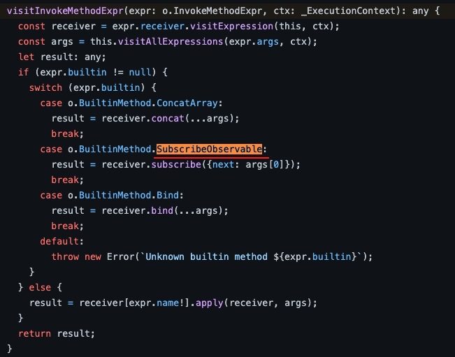

# Day 44: Có thể bạn đã biết - Observable for @Output

Hôm nay mình có gợi ý cho 1 Angular dev về cách dùng Observable cho Output. Mình nghĩ cái này cũng có 1 số các bạn Angular dev mới không biết vì trong documentations không đề cập tới. Mình sẽ đi vào code ngay lập tức và sẽ giải thích ở dưới

## Before

```ts
@Output() someEvent = new EventEmitter();
this.someSource$.pipe(
   // additional logic/transformation
).subscribe(data => this.someEvent.emit(data));
```

## After

```ts
@Output() someEvent = this.someSource$.pipe(
  /* additional logic transformation */
);
```

Như các bạn thấy code before và after khá là giống nhau. Use-case ở đây là các bạn muốn dùng Output để emit gì đấy về cho **Parent Component** khi `someSource$` emit data. Nhưng tại sao code after lại hoạt động?

Để hiểu "sâu" hơn 1 tí, các bạn cần hiểu 2 vấn đề sau:

- Event Binding syntax `(eventName)`
- class `EventEmitter`

## Event Binding Syntax ()

Event binding chính là cú pháp dấu ngoặc đơn và tên event, gán cho một method trong class, ví dụ: `<child (someEvent)="invokeSomeEvent()"></child>`.

Angular Compiler sẽ parse template thành Abstract Syntax Tree (AST) để có thêm thông tin về template hiện tại. Trong trường hợp này, Angular Compiler sẽ biết được loại event gì đang được bind.

Source code [của phần này][output_interpreter] có một path check nếu như event đang đc bind là `SubscribeObservable` thì sẽ subscribe vào source.



Điều này có nghĩa là gì? Là `Event Binding syntax ()` sẽ tự động subscribe vào source `Observable` nếu event là 1 `Observable/Subject`

## EventEmitter class

EventEmitter thực chất chỉ là 1 subclass của `Subject` mà thôi. Và như phần lớn các bạn cũng đã biết thì `Subject` vừa là 1 Observable vừa là 1 Observer nên thực chất `@Output` hoạt động là nhờ vào đoạn code trên kia của Angular Compiler (subscribe tự động).

Nắm được 2 khái niệm trên, cách hoạt động của `@Output`, và cách hoạt động của Angular Compiler thì các bạn chắc chắn đã hiểu được tại sao đoạn code After kia lại work.

## Một số use-case

- Interval Output
- State Selector (ngrx)
- ... bất cứ thể loại stream gì mà các bạn nghĩ đến...

Have fun!

## Author

- [Chau Tran](https://github.com/nartc)

`#100DaysOfCodeAngular` `#100DaysOfCode` `#AngularVietNam100DoC_Day44`

[output_interpreter]: https://github.com/angular/angular/blob/6a9e3284329baf1bb6b621a8840ace629eb4b16e/packages/compiler/src/output/output_interpreter.ts#L166
